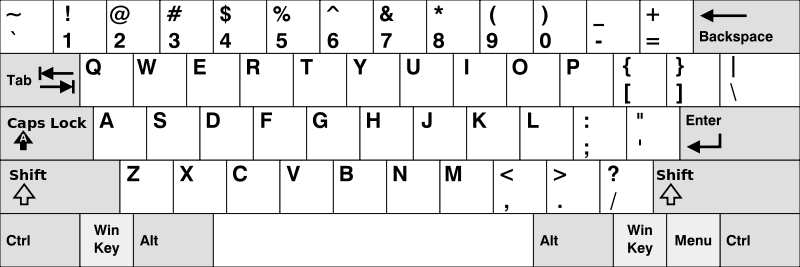

500 Keyboard Row

Given an array of strings code<words>, return the words that can be typed using letters of the alphabet on only one row of American keyboard like the image below.

Note that the strings are case-insensitive, both lowercased and uppercased of the same letter are treated as if they are at the same row.

In the American keyboard:

the first row consists of the characters code<"qwertyuiop">,
the second row consists of the characters code<"asdfghjkl">, and
the third row consists of the characters "zxcvbnm".

Example 1:

Input: words = ["Hello","Alaska","Dad","Peace"]

Output: ["Alaska","Dad"]

Explanation:

Both code<"a"> and code<"A"> are in the 2nd row of the American keyboard due to case insensitivity.

Example 2:

quote Input: words = ["omk"]

quote Output: []

Example 3:

quote Input: words = ["adsdf","sfd"]

quote Output: ["adsdf","sfd"]

Constraints:

- code<1 <= words.length <= 20>
- code<1 <= words[i].length <= 100>
- code<words[i]> consists of English letters (both lowercase and uppercase). 

Copyright (C) Leetcode https://leetcode.com/problems/keyboard-row/description/
